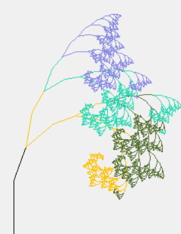
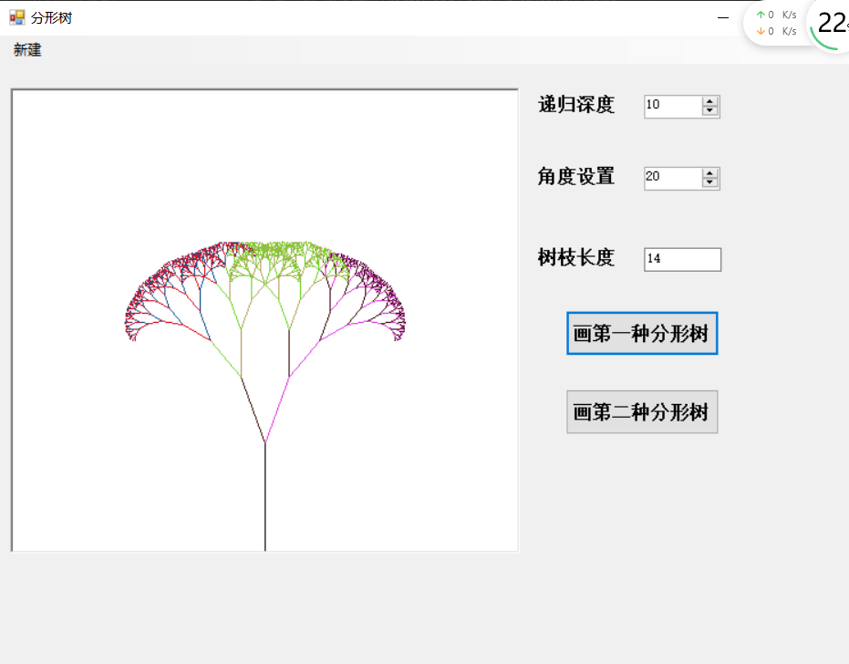

### 实验四 分形树

### 一.  引言

**实验目的:继续学习C#窗体应用程序的图形化界面设计以及GDI+绘图的一些基本指示,通过制作各种类型的分形树增强对于递归的理解,在创造分形图形的过程中感受编程的快乐**


#### Tutorial任务

1.制作不同类型的分形图形(本次演示的是两种不同类型的分形树)

2.设计一个美观合理的UI界面

3.巩固关于打开文件和保存文件的操作

### 二.实验环境

Windows系统下的visual studio 2017

C#窗体应用程序


### 三.实验流程

#### 1.实验原理介绍

首先,我们先介绍一下分形图形的绘制过程(由于分形图形的种类有很多种,但大多数是采用了递归的思想进行绘制,所以本文以较为常见和相对来讲难度不那么大的分形树进行讲解,感兴趣的读者可以尝试去制作更为复杂的分形图形)

首先,我们先来看一段分形树绘制的核心代码

```c#
private void paintFractalTree(Pen pen, float xo, float yo, int depth, double dangle, float length, double angle, Graphics line)
{
    float yf = yo - (sin(Converttohudu(dangle)) * length);//sin函数将角度转换成弧度
	float xf = xo - (cos(Converttohudu(dangle)) * length);
	line.DrawLine(pen, xo, yo, xf, yf);
	paintFractalTree(pen2, xf, yf, depth - 1, dangle + angle, length, angle, line);
	paintFractalTree(pen3, xf, yf, depth - 1, dangle - angle, length, angle, line);//画左分支
}
在上述的代码中我们已经看到了递归的影子,接下来会对递归流程进行详细介绍:
```

百度百科当中关于分形这个几何学术语的解释如下:

```c#
分形，具有以非整数维形式充填空间的形态特征。通常被定义为“一个粗糙或零碎的几何形状，可以分成数个部分，且每一部分都（至少近似地）是整体缩小后的形状”，即具有自相似的性质。
    
分形使人们觉悟到科学与艺术的融合，数学与艺术审美上的统一，使从前枯燥的数学不再仅仅是抽象的哲理，而是具体的感受；不再仅仅是揭示一类存在，而是一种艺术创作，分形搭起了科学与艺术的桥梁。
```

通过**"每一部分都（至少近似地）是整体缩小后的形状”，即具有自相似的性质。**这一点也能够看出做出分形图案的主要思想就是递归.

我们先考虑当分形树的分形元是下述图案的情况:


这个分形元在C#中是怎么绘制出来的呢?

**1.首先,我们设A点坐标为(x,y),B点坐标为(x0,y0)**

**2.接下来绘制AB这条直线,也就是树的主干部分,即(x,y)--(x0,y0)直线,同时注意到,AB这条线段与横轴的夹角为90度,那么我们就以这个90度作为基础,结合用户输入的angle角度的可调整值,来绘制接下来的分形树分支**

**3.假设C点坐标为(x1,y1),则由三角函数的性质,结合上图中的α角我们可以看出C点的横坐标为x0-L'×cos(90°-α)(注意,这里面的L'指的是枝干的长度,为了让我们的分形树绘制的更加美观,这里面取枝干长度L'=2L/3,α就是用户输入的角度值)**

**4.类比3的思路,C点的y坐标y1为y0-L'×sin(90°-α)(值得注意的是,绘图板的左上角为(0,0),所以在向上绘制的时候相应的y坐标就会减少)**

**5.结合刚才的思想,我们很容易根据图中的提示绘制出右侧的分支,D点的横坐标为x0-L'×cos(90°+α),D点的纵坐标为y0-L'×sin(90°+α),如上图所示**

**6.连接BC,BD,分形元绘制完成**


#### 2.实验过程

这个时候我们回过头来看刚才的那段代码,就显得清楚多了

```c#
private void paintFractalTree(Pen pen, float xo, float yo, int depth, double dangle, float length, double angle, Graphics line)//dangle是目前的角度,也就是刚才说的(90+angle)或者(90-angle)传入作为dangle(其实就是需要计算正余弦的角度)
{
    float yf = yo - (sin(Converttohudu(dangle)) * length);//sin函数将角度转换成弧度,算出新的点所应该在的位置的纵坐标
	float xf = xo - (cos(Converttohudu(dangle)) * length);//算出新的点所应该在的位置的横坐标
	line.DrawLine(pen, xo, yo, xf, yf);//将原来点和新的点之间连一条线
	paintFractalTree(pen2, xf, yf, depth - 1, dangle + angle, length, angle, line);//递归画右分支
	paintFractalTree(pen3, xf, yf, depth - 1, dangle - angle, length, angle, line);//画左分支
}
//对于递归部分而言,需要注意再下一次递归的时候初始角度相当于不再是90度了,而是90-a(如果是左分支的话),或者是(90+a)(如果是右分支的话),以后每次递归都需要更新前面的角度值(也就是每次传入参数的dangle),通过设置递归深度可以绘制出如下的美丽图形:
```

**注:读者可以在上述基础上做出创新,比如给这颗分形树绘制不同的颜色,让不同的分支长度不同等等,在这里我绘制了一种随机颜色的分形树,效果和代码部分如下:**

```c#
private void paintFractalTree(Pen pen, float xo, float yo, int depth, double dangle, float length, double angle, Graphics line)
        {
            if (depth > -1)
            {
                length = length * 2 / 3;
                float yf = yo - (sin(Converttohudu(dangle)) * length);//转换成弧度
                float xf = xo - (cos(Converttohudu(dangle)) * length);
                line.DrawLine(pen, xo, yo, xf, yf);
                Random rnd = new Random();
                // 随机色生成,可以画出彩色的树
                Color myColor1 = Color.FromArgb
                    (
                         rnd.Next(0, 255), /*红色*/
                         rnd.Next(0, 255), /*绿色*/
                         rnd.Next(0, 255)  /*蓝色*/
                    );

                Pen pen2 = new Pen(myColor1);

                paintFractalTree(pen2, xf, yf, depth - 1, dangle + angle, length, angle, line);//画右分支
                Color myColor2 = Color.FromArgb
                    (
                         rnd.Next(0, 255), /*红色*/
                         rnd.Next(0, 255), /*绿色*/
                         rnd.Next(0, 255)  /*蓝色*/
                    );
                Pen pen3 = new Pen(myColor2);
                
                paintFractalTree(pen3, xf, yf, depth - 1, dangle - angle, length, angle, line);//画左分支
            }
        }
```

几个较为美观的色彩图如下图所示:


通过不同的angle角度的设置,可以产生许多好看的图形,以上为30度和60度以及90度设置下的图形,读者可以自行尝试其他方案,绘制更好看的分形树


#### 3.实验创新

绘制出了上述的最简单的分形树之后,我们也许会思考其他分形元是不是会画出其他神奇的分形图案?答案是肯定的,接下来我会以我绘制的第二种分形树为例,向读者展示绘制不同种分形树的一般方法:

首先来看第二种分形树的效果图:



细心的读者可能已经发现了,实际上绘制一颗分形树的要点就在于一定要掌握好递归的思想,我们简单看一下上图就不难分析出分形元是如下这种图形了:


再分解一下其实就是图中的黑色部分了,也就是我们首先要绘制出黑色的部分,具体的原理读者可以自行尝试一下,在这里直接给出核心代码:

```c#
private void paintFractalTree2(Pen pen, float xo, float yo, int depth, double dangle, float length, double angle, Graphics line)
        {
            double attach = 50;
            if (depth > -1)
            {
                
                float changelength = length * 2 / 3;
                float x1 = xo - (cos(Converttohudu(dangle))) * length;
                float y1 = yo- (sin(Converttohudu(dangle)))*length;
                float x2 = x1 - (cos(Converttohudu(dangle))) * changelength;
                float y2 = y1 - (sin(Converttohudu(dangle))) * changelength;
                float x2r = x1 - (cos(Converttohudu(dangle+angle))) * changelength;
                float y2r = y1 - (sin(Converttohudu(dangle+angle))) * changelength;
                float x2l = x1 - (cos(Converttohudu(dangle -angle))) * changelength;
                float y2l = y1 - (sin(Converttohudu(dangle - angle))) * changelength;
                line.DrawLine(pen, xo, yo, x1, y1);
                //line.DrawLine(pen, x1, y1, x2, y2);
                line.DrawLine(pen, x1, y1, x2r, y2r);
                //line.DrawLine(pen, x1, y1, x2l, y2l);
                
               
                Random rnd = new Random();
                // 随机色生成
                Color myColor1 = Color.FromArgb
                    (
                         rnd.Next(0, 255), /*红色*/
                         rnd.Next(0, 255), /*绿色*/
                         rnd.Next(0, 255)  /*蓝色*/
                    );

                Pen pen2 = new Pen(myColor1);
                paintFractalTree2(pen2, x2r, y2r, depth - 1, dangle + angle*3/2 + angle, length*2/3, angle, line);//画右分支,这里让角度发生了变化,起到一个图形"折起来"的效果
                paintFractalTree2(pen2, x2r, y2r, depth - 1, dangle + angle * 3 / 2 - angle, length*2/3, angle, line);//画左分支
                //paintFractalTree2(pen2, x2l, y2l, depth - 1, dangle - angle * 3 / 2 - angle, length*2/3, 
//这句话加上去又是一种新的图案了,可以试试?
                Color myColor2 = Color.FromArgb
                    (
                         rnd.Next(0, 255), /*红色*/
                         rnd.Next(0, 255), /*绿色*/
                         rnd.Next(0, 255)  /*蓝色*/
                    );
                Pen pen3 = new Pen(myColor2);
              
            }
        }
```

到这里,我们的两种分形树就绘制完成了,可以结合之前的画图软件的操作将我们喜欢的分形树图案保存起来,也可以打开之前绘制好的分形树图案,绘制的窗体界面如下:



总的代码如下图所示(窗体设计部分已省去)

```c#
using System;
using System.Collections.Generic;
using System.ComponentModel;
using System.Data;
using System.Drawing;
using System.Drawing.Imaging;
using System.Linq;
using System.Text;
using System.Threading.Tasks;
using System.Windows.Forms;
using System.Threading;
using System.IO;

namespace FractalTree
{
    public partial class Form1 : Form
    {
        bool click1 = false;
        bool click2 = false;
        //文件名
        public string curFileName= @"E:\期末考试复习\C#\分形树v3.0\FractalTree\FractalTree\bin\Debug\picture.jpg";
        //图像对象
        private System.Drawing.Bitmap curBitmap;
        //public Bitmap bmp = new Bitmap(769, 650);

        public Form1()
        {
            InitializeComponent();
            this.MaximizeBox = false;
            this.Size = new Size(769, 650);
            this.CenterToScreen();
            this.FormBorderStyle = FormBorderStyle.FixedSingle;
            picturebox.BorderStyle = BorderStyle.Fixed3D;
            this.Text = "分形树";
            curBitmap = (Bitmap)Image.FromFile(curFileName);
          
            //Graphics g = Graphics.FromImage(bmp);
            //picturebox.Image = ;
            //curBitmap = (Bitmap)bmp;
        }

        public void pictureBox_Paint(object sender, PaintEventArgs e)
        {

            //Graphics g = this.CreateGraphics();
            //picturebox.Refresh();
            if (curBitmap != null)
                {
                //使用DrawImage的方法绘制图像
                Graphics g = e.Graphics;
                //curBitmap.Width, curBitmap.Height图像的宽度和高度
                g.DrawImage(curBitmap, 0, 0, curBitmap.Width, curBitmap.Height);
                }
            if (click1)
            {
                //picturebox.Refresh();
                //Graphics g = e.Graphics;
                //if(curFileName!=null)
                curBitmap = (Bitmap)Image.FromFile(curFileName);
                //else
                  //  curBitmap = bmp;
                this.picturebox.Image = curBitmap;
                Graphics g = Graphics.FromImage(this.picturebox.Image);
                Pen pen = new Pen(Color.Black);
                float length = Convert.ToSingle(tb1.Text) * 10;
                double angle = Convert.ToDouble(nud3.Value);
                int depth = Convert.ToInt32(nud1.Value);
                float xo = (picturebox.Width / 2) - 2;
                float yo = picturebox.Height - Convert.ToSingle(5.4);  
                paintFractalTree(pen, xo, yo, depth, 90, length, angle, g);//那个90是确定这颗树往哪个方向开始长的
                pen.Dispose();
                click1 = false;
            }
            else if(click2)
            {
                //picturebox.Refresh();
                if (curFileName != null)
                    curBitmap = (Bitmap)Image.FromFile(curFileName);
                //else
                  //  curBitmap = bmp;
                this.picturebox.Image = curBitmap;
                Graphics g = Graphics.FromImage(this.picturebox.Image);
                //Graphics g = e.Graphics;
                Pen pen = new Pen(Color.Black);
                float length = Convert.ToSingle(tb1.Text) * 10;
                double angle = Convert.ToDouble(nud3.Value);
                int depth = Convert.ToInt32(nud1.Value);
                float xo = (picturebox.Width / 2) - 2;
                float yo = picturebox.Height - Convert.ToSingle(5.4);
                paintFractalTree2(pen, xo, yo, depth, 90, length*1/2, angle, g);//那个90是确定这颗树往哪个方向开始长的
                pen.Dispose();
                click2 = false;
            }
        }

        private void paintFractalTree(Pen pen, float xo, float yo, int depth, double dangle, float length, double angle, Graphics line)
        {
            if (depth > -1)
            {
                length = length * 2 / 3;
                float yf = yo - (sin(Converttohudu(dangle)) * length);//转换成弧度
                float xf = xo - (cos(Converttohudu(dangle)) * length);
                line.DrawLine(pen, xo, yo, xf, yf);
                Random rnd = new Random();
                // 随机色生成
                Color myColor1 = Color.FromArgb
                    (
                         rnd.Next(0, 255), /*红色*/
                         rnd.Next(0, 255), /*绿色*/
                         rnd.Next(0, 255)  /*蓝色*/
                    );

                Pen pen2 = new Pen(myColor1);

                paintFractalTree(pen2, xf, yf, depth - 1, dangle + angle, length, angle, line);//画右分支
                Color myColor2 = Color.FromArgb
                    (
                         rnd.Next(0, 255), /*红色*/
                         rnd.Next(0, 255), /*绿色*/
                         rnd.Next(0, 255)  /*蓝色*/
                    );
                Pen pen3 = new Pen(myColor2);
                
                paintFractalTree(pen3, xf, yf, depth - 1, dangle - angle, length, angle, line);//画左分支
            }
        }

        private void paintFractalTree2(Pen pen, float xo, float yo, int depth, double dangle, float length, double angle, Graphics line)
        {
            double attach = 50;
            if (depth > -1)
            {
                
                float changelength = length * 2 / 3;
                float x1 = xo - (cos(Converttohudu(dangle))) * length;
                float y1 = yo- (sin(Converttohudu(dangle)))*length;
                float x2 = x1 - (cos(Converttohudu(dangle))) * changelength;
                float y2 = y1 - (sin(Converttohudu(dangle))) * changelength;
                float x2r = x1 - (cos(Converttohudu(dangle+angle))) * changelength;
                float y2r = y1 - (sin(Converttohudu(dangle+angle))) * changelength;
                float x2l = x1 - (cos(Converttohudu(dangle -angle))) * changelength;
                float y2l = y1 - (sin(Converttohudu(dangle - angle))) * changelength;
                line.DrawLine(pen, xo, yo, x1, y1);
                //line.DrawLine(pen, x1, y1, x2, y2);
                line.DrawLine(pen, x1, y1, x2r, y2r);
                //line.DrawLine(pen, x1, y1, x2l, y2l);
                
               
                Random rnd = new Random();
                // 随机色生成
                Color myColor1 = Color.FromArgb
                    (
                         rnd.Next(0, 255), /*红色*/
                         rnd.Next(0, 255), /*绿色*/
                         rnd.Next(0, 255)  /*蓝色*/
                    );

                Pen pen2 = new Pen(myColor1);
                paintFractalTree2(pen2, x2r, y2r, depth - 1, dangle + angle*3/2 + angle, length*2/3, angle, line);//画右分支
                paintFractalTree2(pen2, x2r, y2r, depth - 1, dangle + angle * 3 / 2 - angle, length*2/3, angle, line);//画右分支
                //paintFractalTree2(pen2, x2l, y2l, depth - 1, dangle - angle * 3 / 2 - angle, length*2/3, angle, line);//画右分支
                //paintFractalTree2(pen2, x2l, y2l, depth - 1, dangle - angle * 3 / 2 + angle, length * 2 / 3, angle, line);//画右分支

                Color myColor2 = Color.FromArgb
                    (
                         rnd.Next(0, 255), /*红色*/
                         rnd.Next(0, 255), /*绿色*/
                         rnd.Next(0, 255)  /*蓝色*/
                    );
                Pen pen3 = new Pen(myColor2);
              
            }
        }

        private float cos(double angle)
        {
            return (float)Math.Cos(angle);
        }//求cos的值

        private float sin(double angle)
        {
            return (float)Math.Sin(angle);
        }//求sin的值

        private double Converttohudu(double angle)
        {
            return (Math.PI * angle) / 180;
        }//将角度转换成弧度

        private void textBox1_KeyPress(object sender, KeyPressEventArgs e)
        {
            if (!Char.IsDigit(e.KeyChar) && !Char.IsControl(e.KeyChar) && !e.KeyChar.Equals(','))
            {
                e.Handled = true;//可以从文本框中获取键盘读入的数据
            }
        }

        private void drawbt_Click(object sender, EventArgs e)
        {
            click1 = true;
            picturebox.Refresh();
        }

        private void nud3_ValueChanged(object sender, EventArgs e)
        {

        }

        private void nud1_ValueChanged(object sender, EventArgs e)
        {

        }

        private void Form1_Load(object sender, EventArgs e)
        {

        }

        private void 打开ToolStripMenuItem_Click(object sender, EventArgs e)
        {
            OpenFileDialog opnDlg = new OpenFileDialog();
            opnDlg.Filter = "所有图像文件 | *.bmp; *.pcx; *.png; *.jpg; *.gif;" +
                "*.tif; *.ico; *.dxf; *.cgm; *.cdr; *.wmf; *.eps; *.emf|" +
                "位图( *.bmp; *.jpg; *.png;...) | *.bmp; *.pcx; *.png; *.jpg; *.gif; *.tif; *.ico|" +
                "矢量图( *.wmf; *.eps; *.emf;...) | *.dxf; *.cgm; *.cdr; *.wmf; *.eps; *.emf";
            opnDlg.Title = "打开图像文件";
            opnDlg.ShowHelp = true;
            if (opnDlg.ShowDialog() == DialogResult.OK)
            {
                 curFileName = opnDlg.FileName;
                try
                {
                    curBitmap = (Bitmap)Image.FromFile(curFileName);
                }
                catch (Exception exp)
                {
                    MessageBox.Show(exp.Message);
                }
            }
            //对窗体进行重新绘制，这将强制执行paint事件处理程序
            Invalidate();
            picturebox.Refresh();


        }
        //private void Form1_Paint(object sender, PaintEventArgs e)
        //{
        //    //使用窗体的Paint事件的PaintEventArgs属性来获取一个与窗体相关联的Graphic对象。
        //    Graphics g = e.Graphics;
        //    if (curBitmap != null)
        //    {
        //        //使用DrawImage的方法绘制图像
        //        //160,20 :显示在主窗体内，图像左上角的坐标
        //        //curBitmap.Width, curBitmap.Height图像的宽度和高度
        //        g.DrawImage(curBitmap, 160, 20, curBitmap.Width, curBitmap.Height);
        //    }
        //}


        public void 保存ToolStripMenuItem_Click(object sender, EventArgs e ){ }
        private void button1_Click(object sender, EventArgs e)
        {
            click2 = true;
            picturebox.Refresh();
        }

        private void 保存ToolStripMenuItem_Click_1(object sender, EventArgs e)
        {
            
            if (curBitmap == null)
            {
                
                return;
            }
            Graphics g = Graphics.FromImage(curBitmap);
            SaveFileDialog saveDlg = new SaveFileDialog();
            saveDlg.Title = "保存为";
            saveDlg.OverwritePrompt = true;
            saveDlg.Filter =
                "BMP文件 (*.bmp) | *.bmp|" +
                "Gif文件 (*.gif) | *.gif|" +
                "JPEG文件 (*.jpg) | *.jpg|" +
                "PNG文件 (*.png) | *.png";
            saveDlg.ShowHelp = true;
            if (saveDlg.ShowDialog() == DialogResult.OK)
            {
                string fileName = saveDlg.FileName;
                string strFilExtn = fileName.Remove(0, fileName.Length - 3);
                switch (strFilExtn)
                {
                    case "bmp":
                        curBitmap.Save(fileName, System.Drawing.Imaging.ImageFormat.Bmp);
                        break;
                    case "jpg":
                        curBitmap.Save(fileName, System.Drawing.Imaging.ImageFormat.Jpeg);
                        break;
                    case "gif":
                        curBitmap.Save(fileName, System.Drawing.Imaging.ImageFormat.Gif);
                        break;
                    case "tif":
                        curBitmap.Save(fileName, System.Drawing.Imaging.ImageFormat.Tiff);
                        break;
                    case "png":
                        curBitmap.Save(fileName, System.Drawing.Imaging.ImageFormat.Png);
                        break;
                    default:
                        break;
                }
            }
        }

        private void 另存为ToolStripMenuItem_Click(object sender, EventArgs e)
        {
            if (curBitmap == null)
            {

                return;
            }
            Graphics g = Graphics.FromImage(curBitmap);
            SaveFileDialog saveDlg = new SaveFileDialog();
            saveDlg.Title = "保存为";
            saveDlg.OverwritePrompt = true;
            saveDlg.Filter =
                "BMP文件 (*.bmp) | *.bmp|" +
                "Gif文件 (*.gif) | *.gif|" +
                "JPEG文件 (*.jpg) | *.jpg|" +
                "PNG文件 (*.png) | *.png";
            saveDlg.ShowHelp = true;
            if (saveDlg.ShowDialog() == DialogResult.OK)
            {
                string fileName = saveDlg.FileName;
                string strFilExtn = fileName.Remove(0, fileName.Length - 3);
                switch (strFilExtn)
                {
                    case "bmp":
                        curBitmap.Save(fileName, System.Drawing.Imaging.ImageFormat.Bmp);
                        break;
                    case "jpg":
                        curBitmap.Save(fileName, System.Drawing.Imaging.ImageFormat.Jpeg);
                        break;
                    case "gif":
                        curBitmap.Save(fileName, System.Drawing.Imaging.ImageFormat.Gif);
                        break;
                    case "tif":
                        curBitmap.Save(fileName, System.Drawing.Imaging.ImageFormat.Tiff);
                        break;
                    case "png":
                        curBitmap.Save(fileName, System.Drawing.Imaging.ImageFormat.Png);
                        break;
                    default:
                        break;
                }
            }
        }
    }
    }


```

至此,我们的分形树以及相关代码实现就完成了

参考资料:https://blog.csdn.net/perterli/article/details/78513914

https://download.csdn.net/download/jocodeoe/5740675?utm_medium=distribute.pc_relevant_t0.none-task-download-OPENSEARCH-1.control&depth_1-utm_source=distribute.pc_relevant_t0.none-task-download-OPENSEARCH-1.control